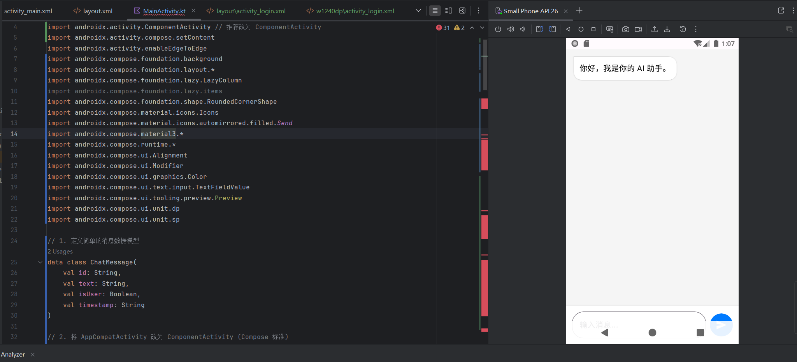
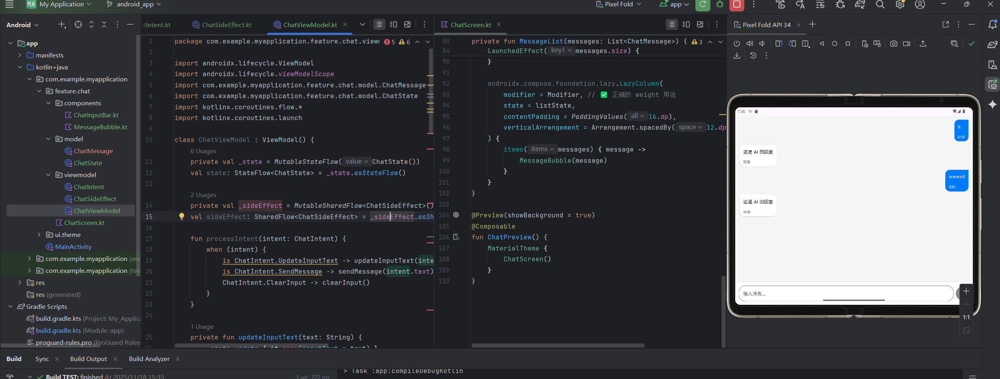
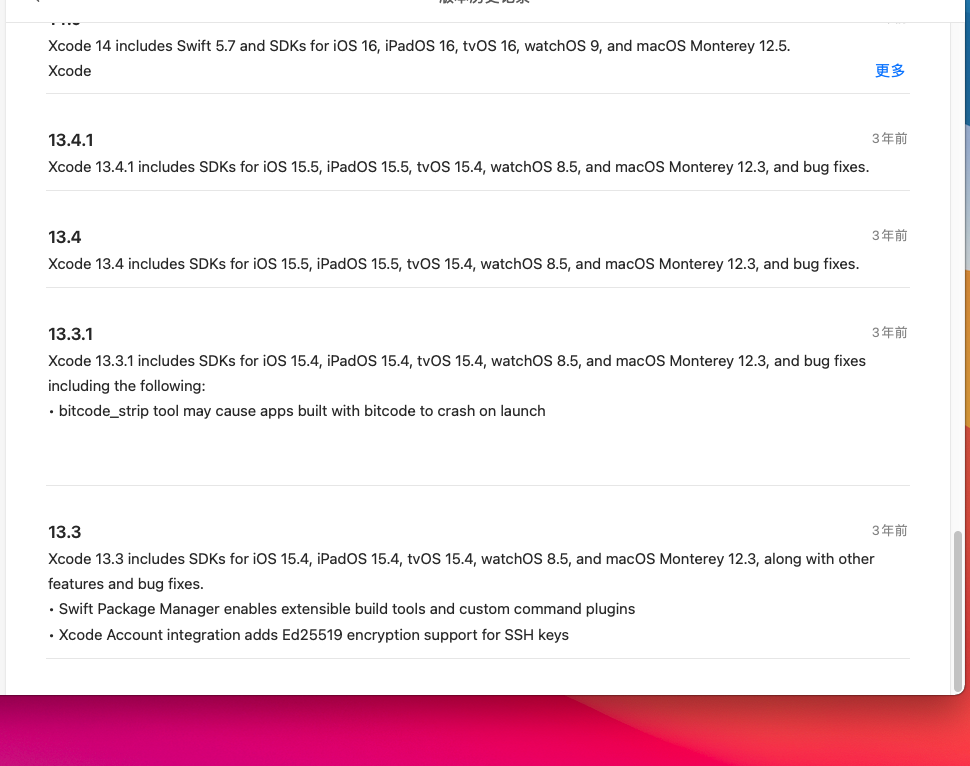

# JIMENG
jimeng对话app

| 周次               | 核心任务                 | Android 平台                                                 | iOS 平台                                                     | 交付产物与评审点                                             |
| :----------------- | :----------------------- | :----------------------------------------------------------- | :----------------------------------------------------------- | :----------------------------------------------------------- |
| **第一周**         | **环境搭建与静态界面**   | 搭建 Android Studio 环境，配置 Kotlin 与 Jetpack Compose。使用 AI 辅助创建项目结构。**独立完成**：使用 Compose 构建一个**静态**的聊天界面，包含输入框、发送按钮和几条写死的聊天气泡。工程架构 MVI 代码组织范式 | 搭建 Xcode 环境，熟悉 Swift 与 SwiftUI。使用 AI 辅助创建项目结构。**独立完成**：使用 SwiftUI 构建一个**静态**的聊天界面，与 Android 版功能对齐。工程架构 MVVM 代码组织范式 | 两个平台的项目骨架。静态聊天界面的截图。**评审点**：环境是否配置成功，静态 UI 是否实现。 |
| **第二周**         | **网络请求与状态管理**   | 使用 Retrofit 集成 API 调用。在 ViewModel 中使用 Kotlin 协程和 `StateFlow` 管理网络请求状态和聊天数据。将界面与 ViewModel 连接，实现一个能与 AI **真实对话**的 MVP 版本。 | 使用 URLSession 和 Combine 集成 API 调用。在 ViewModel 中使用 `Published` 属性和 `sink` 管理网络状态和聊天数据。将界面与 ViewModel 连接，实现与 Android 版功能对齐的 MVP 版本。 | 可运行的 Android 和 iOS App。演示视频，展示两个 App 都能与 AI 对话。**评审点**：功能完整性，**代码对比分析（异步处理部分）**。 |
| **第****三****周** | **本地存储与数据持久化** | 引入 Room 数据库。使用 AI 辅助，编写 `Entity`, `DAO` 和 `Database` 类。将网络请求成功后的对话历史**保存到 Room**，并在 App 启动时加载。 | 引入 Core Data。使用 AI 辅助，创建数据模型 (`.xcdatamodeld`) 和相关的存取代码。将网络请求成功后的对话历史**保存到 Core Data**，并在 App 启动时加载。 | 更新后的 App，支持离线查看历史消息。**AI 指令 Prompt** 列表（用于生成数据库代码）。**评审点**：本地存储功能是否实现，**AI 指令工程质量**。 |
| **第四周**         | **平台适配与最终交付**   | **平台特性**：研究并实现 Android 的权限模型（如网络权限）。**优化**：使用 Profiler 检查并优化性能。准备最终交付物。 | **平台特性**：研究并实现 iOS 的权限模型（如网络权限）。**优化**：使用 Instruments 检查并优化性能。准备最终交付物。 | 两个独立的、最终版的代码仓库。**并排演示**两个 App 的最终视频。**双平台实现对比分析报告**。 |

# WEEK 1

## Android平台

搭建了Android Studio 环境，配置 Kotlin 与 Jetpack Compose。

先用**Gemini**使用 Compose 构建一个静态的聊天界面，包含输入框、发送按钮和几条写死的聊天气泡



熟悉了MVI代码组织架构范式，把代码转换成了MVI的架构

- components -> view层发送intent
- model 定义了数据模型和状态定义
- viewmodel 处理intent然后更新view



#### 对话功能的搭建（vibe coding）

需求是用http post调用大模型api，然后解析它的返回，直接写功能函数即可，然后和页面的message结合。就给出请求体样例和响应体样例让ai写一个http请求即可。

```text
  "model": "qwen-plus",
  "messages": [
    {
      "role": "system",
      "content": "You are a helpful assistant."
    },
    {
      "role": "user",
      "content": "你是谁？"
    }
  ],
  "stream": true,
  "stream_options": {
    "include_usage": true
  },
  "top_p": 0.8,
  "temperature": 0.7,
  "enable_thinking": true
}
请求体样例如上，响应体样例如下
data: {"choices":[{"delta":{"content":null,"role":"assistant","reasoning_content":""},"index":0,"logprobs":null,"finish_reason":null}],"object":"chat.completion.chunk","usage":null,"created":1763612375,"system_fingerprint":null,"model":"qwen-plus","id":"chatcmpl-a25dc554-ddb5-4ee5-b33c-cd078fb16954"}

data: {"choices":[{"finish_reason":null,"logprobs":null,"delta":{"content":null,"reasoning_content":"嗯"},"index":0}],"object":"chat.completion.chunk","usage":null,"created":1763612375,"system_fingerprint":null,"model":"qwen-plus","id":"chatcmpl-a25dc554-ddb5-4ee5-b33c-cd078fb16954"}

.......

data: [DONE]```
```

但是和我的app message结合的时候出现了问题


可以看到，第二次回复的时候，我的回复后面跟了ai的回复。询问了ai，反馈是用System.currentTimeMillis()生成id的，可能导致id相同，所以后面改成了uuid来生成。成功解决了问题。

#### 上下文对话功能

直接在viewmodel里实现就行，现在没有上下文管理


#### debug case

为了快速测试我的对话app还是写个debugcase比较省事，让ai写吧

测试简单化调用


#### 实现流式传输

这一步调的比较久了，因为它默认写的流式方法是对的，即使我传的参数也没问题，但是它还是阻塞性的返回了流式的结果，修改了日志的阻塞，然后日志不阻塞了，但是反馈到app的ui上还是阻塞的，ai认为这是因为**collect代码收到一次网络返回就要遍历整个消息列表刷新ui**，效率极低导致的。但其实效率低在过长返回中起码ui还能刷几次吧，事实是ui根本没动，所以还是要从viewmodel里找原因。

结论是**更新flow的时候要去dispatch io一下**，之前的flow就是在主线程上直接执行了，那肯定update不了，属于是只声明了suspend但没有真正的分配一个协程处理io。


## IOS平台

XCODE搭建需要MACBOOK支持，所以只能配置一个macos的虚拟机尝试进行开发，网上的资料说intel架构的苹果的m芯片架构比较相似比较容易配置，amd的只能配置12以下的版本，而且还需要开启cpu虚拟化。这里我的电脑是amd的cpu故只能装macos11。

搞了一天装了macos11之后xcode现在根本不支持这么早的版本，眼前一黑，遂放弃



## WEEK2

#### 超级大坑

  因为文本模型和图片模型都是qwen系列，所以想整合一下我的api调用方法了，这一步就需要重构我的代码（因为之前针对文本调用和图片调用设计了两种model定义），需要把文本生成和图片请求整合到一个请求里。把官网的文档发给ai，跟着ai改。这一步用ai也有一堆调用上的问题，跑起来之后图片的post能够成功调用，但是文本的post却失效了一直返回http 400 invalided parameters，以为是请求体问题，但即使回退到之前的调用请求体仍然是失效的。到了这一步就是抓包找问题了，之前一直是把包log出来的以为是log的包解析有问题，问ai才知道okhttp改下client参数就能直接看到完整的包。缩减了一堆功能并且在与官网的样例请求一一对比之后还是没调回这个bug。最后没招了才测了测官网的样例请求，复制它的curl命令进行测试，结果仍然报错了。。。


本着探索精神（其实有个request成功了好奇为什么成功）发现是它的请求不能出现中文。。。无语了


### Markdown聊天优化

这一步需要导入一个markdown支持的库richtext（ai自己选的，最开始用的markdown支持，不过都是github项目，ai直接导入问题太多了乱输依赖。。。），但是较为冷门，直接使用的话ai对api也用不好，ai用的之前的版本已经下不下来了，所以最新版本的api还是有点兼容问题的，不过没关系，我们把文档样例发给它就好了。


## ROOM数据库支持持久化对话

先要设计表，在app中一个对话里有多个信息，所以目前设计了两个表一个Conversation表一个messages表，用外键把messages表关联到conversation表上，并为conversationId创建索引。

- 设计方法：
  - 先让ai定义好这些表的实体类，这时候不要去改数据类，新建实体类来存数据就好了，实现业务逻辑和数据存储分离。
  - 写好之后用细致的操作逻辑进行vibe coding

## 多模态对话支持

- 对话体验优化：上传图片文件和发送消息异步，可以边上传图片边发送消息，上传图片的时候有个缩略图显示在对话框上方
- 因为上传图片到临时oss存储，它只能用于模型调用，不可预览不可下载，所以本地想要预览图片只能存储本地的uri，这样会导致调用api里的url（这是云端url）和message里的url（本地url）不一样，那再次启动的时候没存云端的url所以上下文就遗忘了
  - 这里构建一个运行时的云端url映射，app在运行的时候会有一个本地到云端的url索引
  - 请求api的时候检查message里的本地图片是否有到云端的索引，如果有就不需要上传了，如果没有就把对话里的本地图片重新上传。
  - 这样的话运行时视觉模型调用会有云端的缓存，一般来说用户一次使用就用一次视觉模型，后续使用也是 


